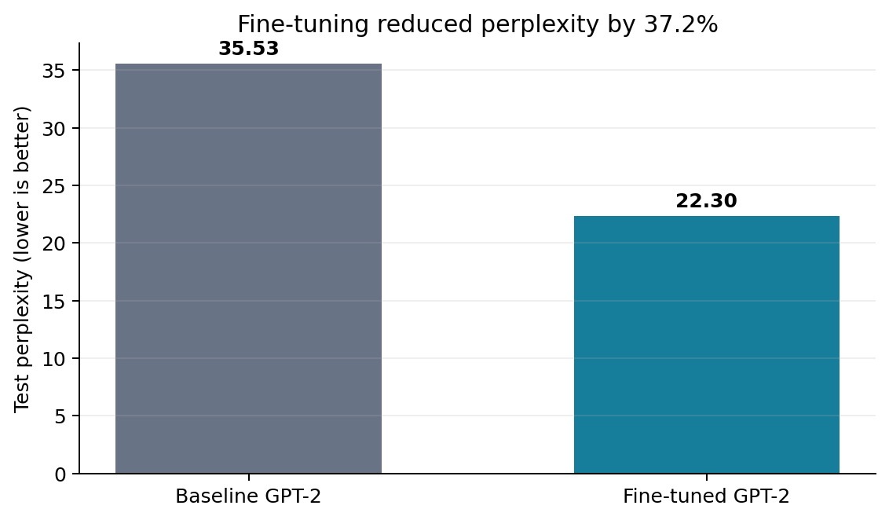
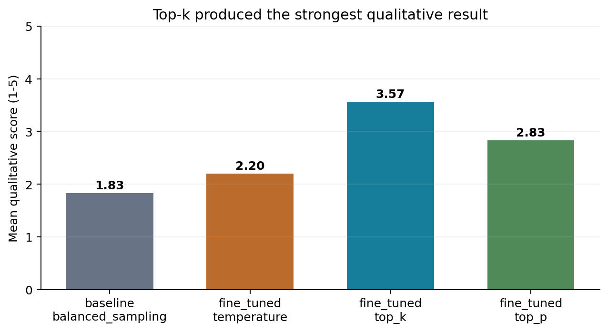

# Lyrics Generator Using a Fine-Tuned GPT-2 Model

An end-to-end NLP project that fine-tunes GPT-2 on song lyrics, compares it with
the original baseline model, and evaluates the effect of different decoding
strategies.

## Results

| Model | Test loss | Test perplexity |
| --- | ---: | ---: |
| Baseline GPT-2 | 3.570 | 35.53 |
| Fine-tuned GPT-2 | 3.105 | 22.30 |

Fine-tuning reduced test perplexity by approximately **37.2%**. Among the
generation settings tested, **top-k sampling** received the strongest overall
qualitative scores for fluency, coherence, emotional tone, and lyric-like
quality.





The executed [results notebook](notebooks/results_analysis.ipynb) contains the
tables, charts, generated examples, metric explanations, discussion, and
limitations.

## Project Pipeline

1. Load 21 artist CSV files and clean encoding artifacts and whitespace.
2. Remove empty, duplicate, and very short lyrics.
3. Create stratified train, validation, and test splits.
4. Fine-tune `openai-community/gpt2` with causal language modeling.
5. Compare baseline and fine-tuned generations using temperature, top-k, and
   top-p sampling.
6. Evaluate test loss, perplexity, and qualitative criteria.

The cleaned dataset contains **5,424 songs**: 4,339 training, 542 validation,
and 543 test examples.

## Repository Structure

```text
src/
  prepare_data.py          Clean and split the lyrics dataset
  train.py                 Fine-tune GPT-2 and save training metrics
  generate.py              Compare baseline and fine-tuned generation
  generate_from_title.py   Interactive title-based comparison
  evaluate.py              Calculate perplexity and summarize ratings
notebooks/
  results_analysis.ipynb   Executed report-ready analysis
results/
  evaluation/              Final quantitative and qualitative metrics
  samples/                 Curated generated lyric comparisons
  training/                Training log and final validation metrics
data/processed/
  dataset_stats.json       Aggregate dataset statistics only
```

## Dataset

The project uses the
[Song Lyrics Dataset on Kaggle](https://www.kaggle.com/datasets/deepshah16/song-lyrics-dataset).
Raw and processed lyrics are intentionally excluded from this public
repository. Download the dataset from Kaggle and place its 21 artist CSV files
in:

```text
dataset lyrics/csv/
```

The scripts expect columns including `Artist`, `Title`, `Year`, and `Lyric`.

## Setup

Python 3.11 and an NVIDIA GPU are recommended.

```powershell
python -m venv .venv
.\.venv\Scripts\Activate.ps1
pip install -r requirements.txt
```

PyTorch installation can vary by CUDA version. See the
[official PyTorch installation guide](https://pytorch.org/get-started/locally/)
if the package installed from `requirements.txt` does not detect your GPU.

## Usage

Run commands from the repository root:

```powershell
python src/prepare_data.py
python src/train.py --smoke_test
python src/train.py
python src/generate.py
python src/evaluate.py
```

After training, compare baseline and fine-tuned lyrics for a title:

```powershell
python src/generate_from_title.py --title "Midnight Rain"
```

The first model load downloads `openai-community/gpt2` from Hugging Face.
Full training used an RTX 3060 12 GB with a block size of 256, batch size 4,
gradient accumulation of 4, mixed precision, and 3 epochs.

## Evaluation Notes

Cross-entropy loss measures next-token prediction error; lower is better.
Perplexity is `exp(loss)` and represents the model's uncertainty when
predicting the next token. These metrics do not directly measure creativity or
musical quality, so generated outputs were also scored for fluency, coherence,
creativity, emotional tone, and lyric-like quality.

The included qualitative scores are an **AI-assisted composer-style
evaluation**, not a human-subject study. They are included as an exploratory
comparison and are labelled accordingly in the notebook.

## Model Weights

The trained model and checkpoints are not included because they total several
gigabytes. The executed notebook and curated result files allow the experiment
to be reviewed without downloading or rerunning the model.

## Author

**[@azfario](https://github.com/azfario)** - data preprocessing, GPT-2
fine-tuning, generation pipeline, evaluation, interactive demo, and results
analysis.

This repository is shared as an academic and portfolio project. See
[ACADEMIC_USE_NOTICE.md](ACADEMIC_USE_NOTICE.md) for usage terms.
